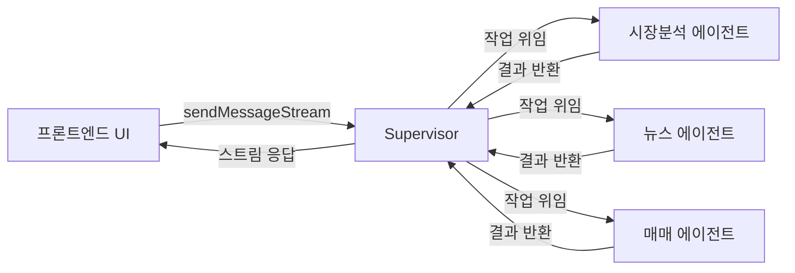
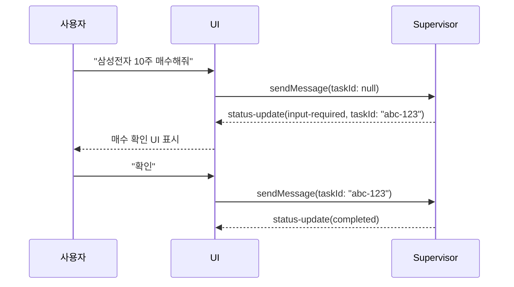

# A2A SDK로 에이전트 챗봇 UI 만들기

> Google A2A(Agent-to-Agent) 프로토콜 기반 AI 투자 자문 챗봇 프론트엔드 개발 경험

---

## 프로젝트 개요

- **목적**: AI 에이전트와 실시간으로 대화하는 챗봇 UI 구현
- **스택**: React + TypeScript + A2A SDK + WebSocket
- **에이전트 구조**: Supervisor → Sub-agents (시장분석, 뉴스, 매매)

---

## A2A 프로토콜이란?

A2A(Agent-to-Agent)는 Google이 제안한 AI 에이전트 간 통신 표준입니다.
에이전트가 서로의 능력을 발견하고 작업을 위임하는 방식을 표준화합니다.



---

## 핵심 구현: 스트림 처리

`client.sendMessageStream()`이 async iterable을 반환하므로 `for await`으로 처리합니다.

```typescript
for await (const event of client.sendMessageStream(params)) {
  if (event.type === "artifact-update") {
    updateArtifact(event)
  }
  if (event.type === "status-update") {
    if (event.status === "input-required") {
      showHITLConfirm(event.taskId)
    }
  }
}
```

`lastChunk === true`가 스트림 완료 신호입니다.

---

## HITL(Human-in-the-Loop) 구현

주식 매매 시 사용자 확인을 받는 흐름입니다.



**핵심**: HITL은 boolean 플래그가 아닌 **동일 task_id 재전송**으로 구현합니다.

---

## Structured Output + Skeleton UI

에이전트 응답을 단순 텍스트가 아닌 구조화된 UI로 표현하기 위해
스트리밍 중에는 Skeleton을 보여주고, `lastChunk` 수신 시 실제 컴포넌트로 교체했습니다.

---

## 배운 점

| 영역 | 교훈 |
|------|------|
| 스트림 처리 | `lastChunk` 플래그로 완료 시점을 명시적으로 처리 |
| HITL | `task_id` 재사용으로 태스크 재개 |
| Sub-agent | `component_response` 이벤트를 Skeleton 트리거로 활용 |
| 대화 저장 | 에이전트용(text)과 UI용(structured) 저장 구조를 분리 설계 |

자세한 내용은 [Lesson Learned](/md/lesson-learned) 아티클을 참고하세요.
