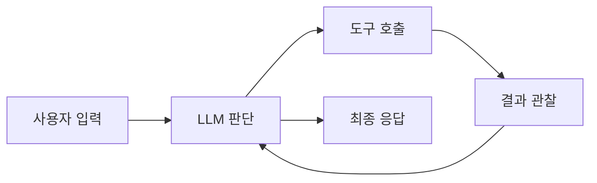
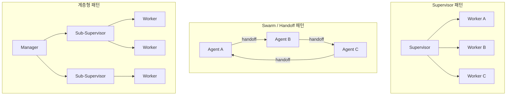
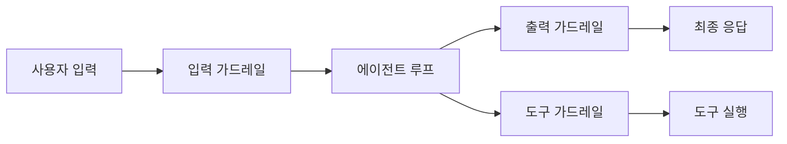
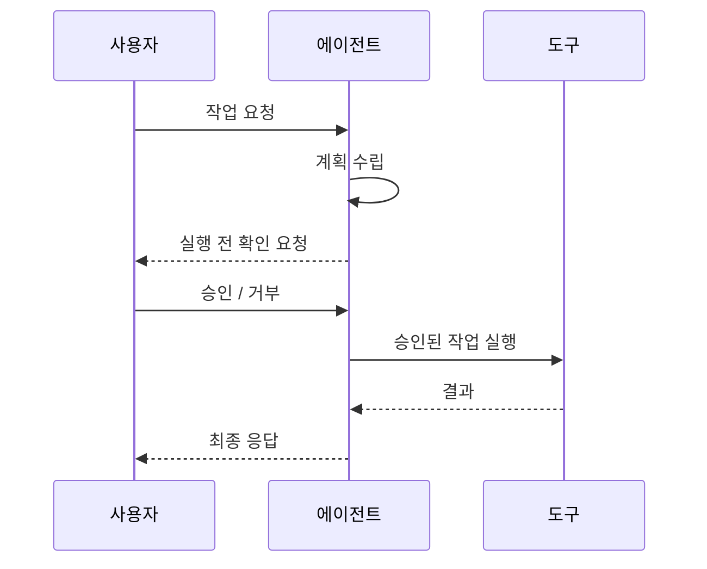
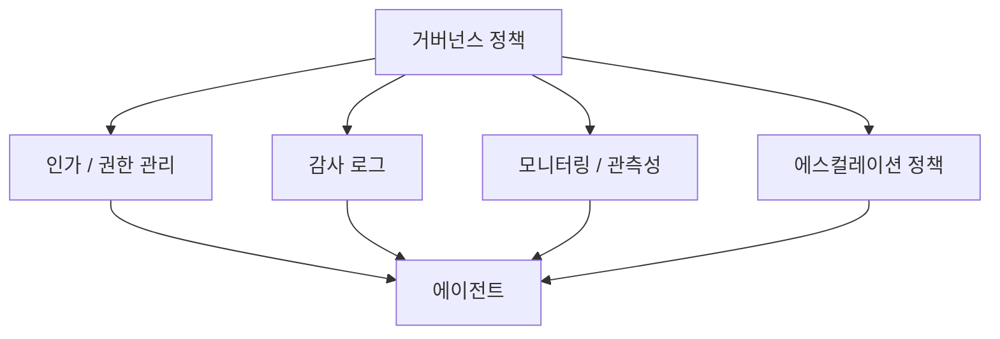
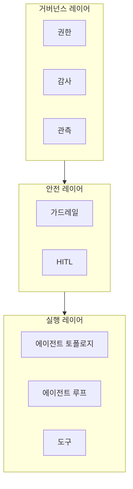

# AI 에이전트 토폴로지와 거버넌스

> 싱글 에이전트 루프부터 멀티 에이전트 토폴로지까지, 그 사이를 잇는 가드레일·HITL·거버넌스

---

## 싱글 에이전트 루프

가장 기본적인 에이전트 구조다. 하나의 LLM이 **관찰 → 판단 → 행동 → 관찰** 사이클을 반복한다.

- LLM이 스스로 "언제 멈출지"를 판단한다
- 도구(tool)를 호출하고 결과를 보고 다음 행동을 결정한다
- ReAct, Function Calling 기반의 에이전트가 이 패턴이다

**장점**: 구현이 단순하고, 하나의 컨텍스트 안에서 모든 판단이 이루어진다.
**한계**: 복잡한 작업에서 컨텍스트가 길어지면 판단 품질이 떨어진다. 역할 분리가 불가능하다.

---

## 멀티 에이전트 토폴로지

작업을 여러 에이전트에게 분배하는 구조다. 토폴로지에 따라 에이전트 간 관계가 달라진다.

### 주요 토폴로지

| 토폴로지 | 특징 | 적합한 상황 |
|---|---|---|
| **Supervisor** | 중앙 에이전트가 작업 위임·결과 통합 | 역할이 명확히 분리되는 작업 |
| **Swarm/Handoff** | 에이전트 간 직접 전환, 중앙 제어 없음 | 대화 흐름이 자연스럽게 전환되는 경우 |
| **계층형** | Supervisor 안에 Sub-supervisor | 대규모·복잡한 작업 분해 |

### 싱글 vs 멀티: 선택 기준

단순히 "멀티가 더 좋다"가 아니다. 에이전트를 늘리면 **통신 비용, 디버깅 난이도, 일관성 유지 비용**이 함께 증가한다.

> 싱글 에이전트로 충분한 작업에 멀티 에이전트를 도입하는 것은 과설계다.

---

## 가드레일 (Guardrails)

에이전트가 **잘못된 방향으로 가지 않도록** 제약을 거는 장치다. 에이전트의 자율성과 안전성 사이의 균형점이다.

### 가드레일의 유형

| 유형 | 위치 | 역할 |
|---|---|---|
| **입력 가드레일** | 에이전트 진입 전 | 프롬프트 인젝션, 부적절한 요청 차단 |
| **출력 가드레일** | 응답 반환 전 | 유해 콘텐츠, 환각(hallucination) 필터링 |
| **도구 가드레일** | 도구 호출 시점 | 위험한 작업(삭제, 결제 등) 실행 전 검증 |

가드레일은 **규칙 기반**(정규식, 키워드)일 수도 있고, **LLM 기반**(별도 모델이 판단)일 수도 있다.

---

## HITL (Human-in-the-Loop)

에이전트가 **특정 시점에서 사람의 판단을 요청**하는 메커니즘이다. 가드레일이 "막는 것"이라면, HITL은 "확인받는 것"이다.

### HITL이 필요한 시점

- **비가역적 작업**: 결제, 삭제, 외부 API 호출
- **높은 불확실성**: 에이전트가 확신이 낮은 판단을 해야 할 때
- **규제 요구사항**: 사람의 승인이 법적으로 필요한 경우

### 실제 구현 경험

A2A 프로토콜에서 HITL을 구현할 때, 처음에는 boolean 플래그로 접근했다가 실패했다. A2A에서 HITL은 **동일 task_id를 재전송하여 태스크를 재개하는 개념**이었다. ([상세 경험](/md/lesson-learned))

> HITL 설계의 핵심: "어디서 끊을 것인가"보다 "어떻게 재개할 것인가"가 더 중요하다.

---

## 거버넌스 (Governance)

가드레일과 HITL이 **개별 행동의 안전장치**라면, 거버넌스는 **에이전트 시스템 전체의 운영 원칙**이다.

### 거버넌스의 핵심 요소

| 요소 | 설명 |
|---|---|
| **권한 관리** | 에이전트가 어떤 도구를, 어떤 범위에서 사용할 수 있는가 |
| **감사 로그** | 에이전트의 모든 판단과 행동을 추적 가능하게 기록 |
| **모니터링** | 비용, 지연시간, 실패율, 품질 지표 실시간 관측 |
| **에스컬레이션** | 에이전트가 처리 불가한 상황의 상위 전달 기준과 경로 |

### 왜 거버넌스인가?

에이전트가 프로덕션에 올라가면 "잘 동작하는가"만으로는 부족하다. **누가 어떤 권한으로 실행했고, 왜 그런 판단을 했으며, 문제가 생겼을 때 누구에게 전달되는가**를 답할 수 있어야 한다.

---

## 전체 구조: 에이전트 시스템의 레이어

아래에서 위로 올라갈수록 추상화 수준이 높아진다:

1. **실행 레이어**: 에이전트가 실제로 동작하는 구조 (싱글/멀티, 도구 호출)
2. **안전 레이어**: 개별 행동의 검증과 사람의 개입 (가드레일, HITL)
3. **거버넌스 레이어**: 시스템 전체의 운영 원칙 (권한, 감사, 모니터링)

---

## 정리

| 개념 | 핵심 질문 |
|---|---|
| 싱글 에이전트 루프 | 하나의 LLM이 반복적으로 판단-행동할 수 있는가? |
| 멀티 에이전트 토폴로지 | 작업을 어떻게 분배하고 통합할 것인가? |
| 가드레일 | 에이전트가 하면 안 되는 것은 무엇인가? |
| HITL | 언제 사람에게 판단을 넘길 것인가? |
| 거버넌스 | 시스템 전체를 어떻게 통제하고 추적할 것인가? |

> 에이전트를 만드는 것보다 **에이전트를 통제하는 것**이 더 어렵다.
> 토폴로지는 "무엇을 할 수 있는가"를 결정하고, 가드레일·HITL·거버넌스는 "무엇을 해도 되는가"를 결정한다.
