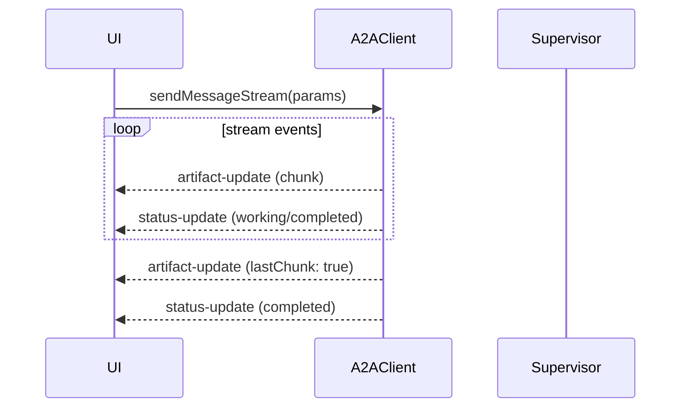
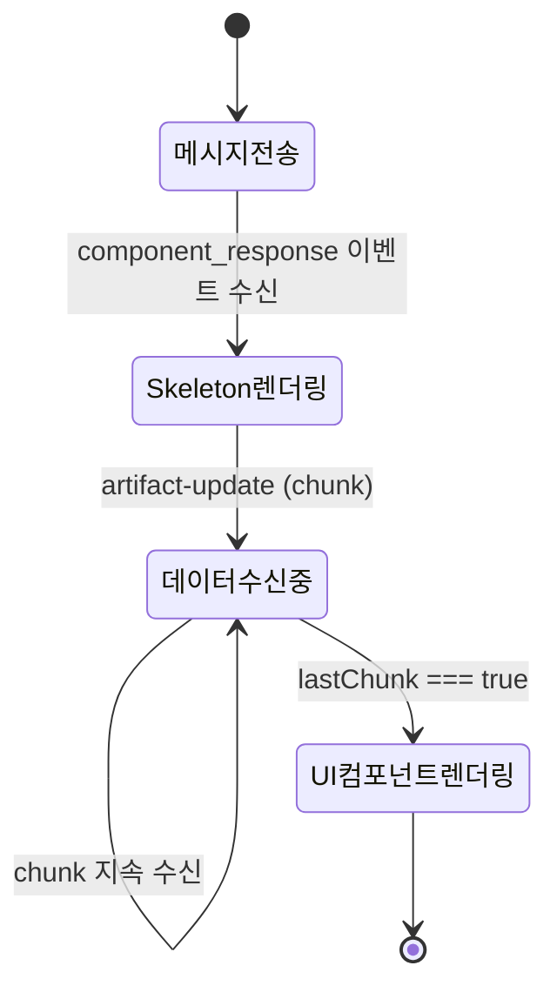
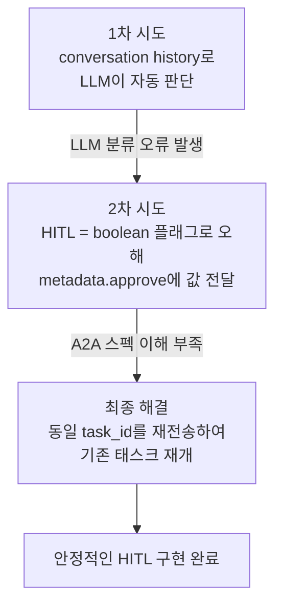
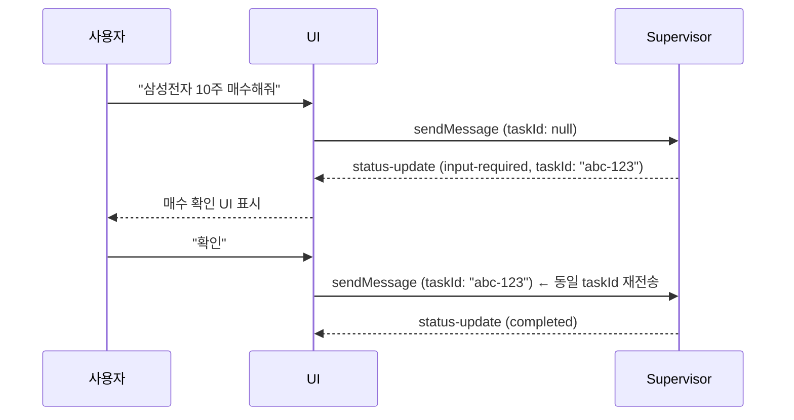
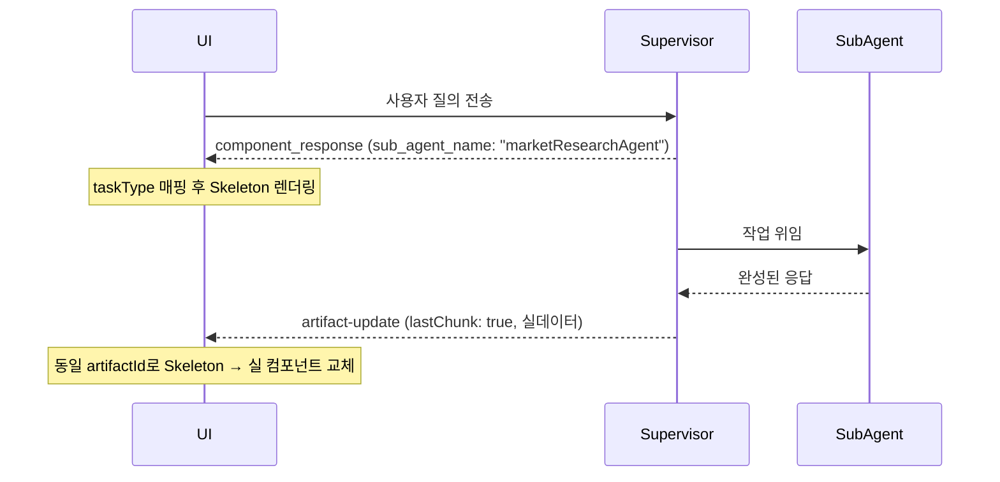
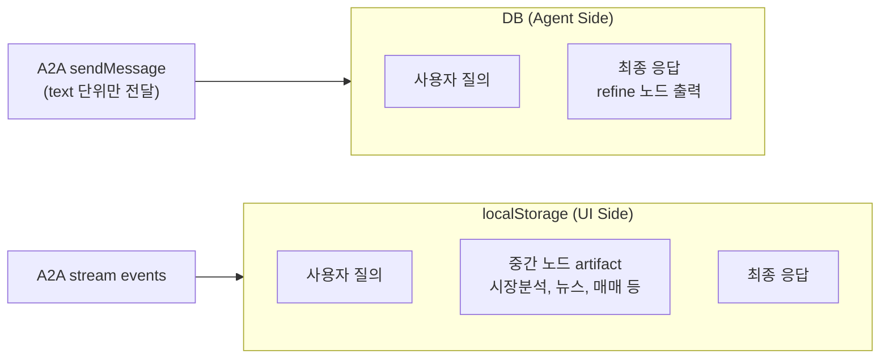
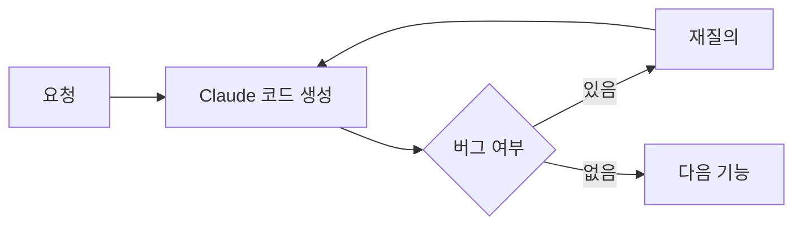
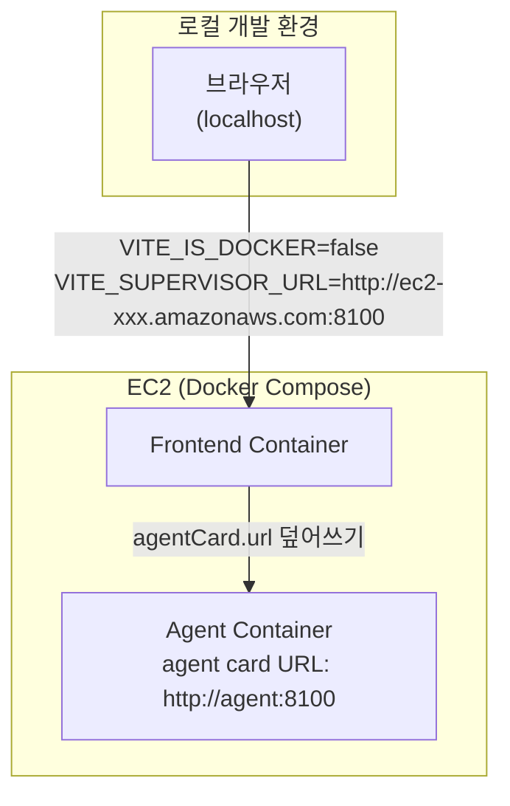

# Lesson Learned — AI 투자 자문 챗봇 프론트엔드

> React + TypeScript + A2A SDK 기반 에이전트 챗봇 개발 회고

---

## 목차

1. [A2A Stream 처리](#1-a2a-stream-처리)
2. [Structured Output과 Skeleton UI](#2-structured-output과-skeleton-ui)
3. [HITL 구현](#3-hitl-human-in-the-loop-구현)
4. [Sub-agent 스트리밍 한계와 해결](#4-sub-agent-스트리밍-한계와-해결)
5. [대화 저장 구조의 이중성](#5-대화-저장-구조의-이중성)
6. [AI 보조 개발 (Claude)에 대한 성찰](#6-ai-보조-개발-claude에-대한-성찰)
7. [AWS 배포 — Docker URL 이슈](#7-aws-배포--docker-url-이슈)

---

## 1. A2A Stream 처리

A2A 프레임워크(`@a2a-js/sdk`)를 통해 비교적 쉽게 스트리밍을 구현할 수 있었다.
`client.sendMessageStream()`이 async iterable을 반환하기 때문에 `for await` 루프로 이벤트를 순서대로 처리했다.

**핵심**: `event.lastChunk === true` 를 통해 스트림 완료를 판별한다.

---

## 2. Structured Output과 Skeleton UI

### 문제

에이전트 응답을 단순 텍스트가 아닌 **보고서 형태의 UI 컴포넌트**로 표현하고 싶었다.
그러나 A2A의 `DataPart`(structured output)도 스트리밍 시에는 결국 **chunk 단위의 text**로 수신된다.
따라서 chunk가 오는 중간에는 완성된 JSON 구조를 파싱할 수 없었다.

### 해결

에이전트가 완성된 JSON 응답을 생성한 뒤 `lastChunk` 플래그로 완료를 알리면, 그 시점에 UI 컴포넌트를 렌더링하는 방식을 채택했다.

### 구현 상세

- `component_response` 이벤트 수신 시 → `isStreaming: true` 상태의 skeleton artifact 생성
- 동일 `artifactId`로 실데이터가 오면 artifact를 덮어씀
- `lastChunk` 수신 시 `isStreaming: false`로 전환 → 실제 컴포넌트 렌더링
- 에러 발생 시 `finally` 블록에서 모든 artifact의 `isStreaming`을 강제로 `false` 처리

### 교훈

> Structured output을 스트리밍으로 받는다고 해도 실시간 렌더링은 불가능하다.
> 완성 시점을 명시하는 신호(`lastChunk`)를 기준으로 UI 전환 타이밍을 잡아야 한다.

---

## 3. HITL (Human-in-the-Loop) 구현

주식 매매 시 사용자 확인을 받는 HITL을 구현하는 과정에서 세 번의 시도가 있었다.

### 최종 구현 방식

- `input-required` 상태의 `status-update` 수신 시 → `taskId`를 `currentTaskIdRef`에 저장
- 사용자가 확인/취소 응답 시 → **동일 `taskId`를 포함하여** 메시지 재전송
- 태스크가 terminal state(`completed`, `failed`, `canceled`, `rejected`)에 진입하면 `taskId` 초기화

### 교훈

> A2A에서 HITL은 단순 boolean 플래그가 아니라 **동일 task를 재개하는 개념**이다.
> `task_id`를 통해 서버 측 태스크 컨텍스트를 유지한다.

---

## 4. Sub-agent 스트리밍 한계와 해결

### 문제

Supervisor(Plan) 에이전트가 작업을 sub-agent에게 위임하는 경우,
**sub-agent의 응답을 직접 스트리밍으로 받을 수 없었다.**
Supervisor를 거쳐 최종 응답만 수신되기 때문에 사용자는 오랜 대기 시간을 경험했다.

### 해결

Plan 단계에서 어떤 sub-agent가 실행될지를 먼저 알 수 있다는 점을 활용했다.

### sub-agent → taskType 매핑

| sub-agent 이름 | taskType |
|---|---|
| `marketResearchAgent` | `market_analysis` |
| `newsAgent` | `news` |
| `companyAnalysisAgent` | `company_analysis` |
| `stockAgent` | `company_analysis` |
| `supervisor` + `trading_prepare_order` | `buy_order` |

### 교훈

> sub-agent를 직접 스트리밍할 수 없다면, **Plan 단계의 시작 이벤트를 Skeleton의 트리거**로 활용하라.
> 사용자는 실제 응답이 오기 전에도 "무언가 처리 중"임을 시각적으로 인지할 수 있다.

---

## 5. 대화 저장 구조의 이중성

### 구조

### 문제

- A2A `sendMessage`는 **text 단위**만 전달 → 에이전트는 DB의 text 이력만 context로 활용
- UI에서는 중간 노드의 artifact(구조화 객체)도 저장·복원이 필요
- 에이전트 DB와 UI localStorage가 **저장하는 데이터의 형태와 범위가 다름**

### 현재 해결책

현재는 대규모 서비스가 아니기 때문에 localStorage에 **단일 대화 context**만 유지한다.
사용자 세션 내에서는 중간 artifact를 포함한 전체 UI 상태를 복원할 수 있다.

### 개선 방향 (고민 중)

- 서버 사이드 DB에 UI용 artifact 별도 저장 레이어 추가
- agent 응답(text)과 UI 렌더링용 데이터(structured)를 명확히 분리하는 저장 스키마 설계
- 다중 대화 context 지원

### 교훈

> 에이전트의 "대화 이력"과 UI의 "대화 이력"은 목적이 다르다.
> 에이전트는 LLM context 재구성용 text가 필요하고, UI는 렌더링을 위한 구조화 데이터가 필요하다.
> 초기 설계 단계에서 이 둘을 명확히 분리할 것.

---

## 6. AI 보조 개발 (Claude)에 대한 성찰

### 배경

UI를 혼자 담당하면서 Claude를 적극적으로 활용했다.
초반에는 코드를 직접 검토했지만, 70% 완성 이후에는 검토 수준이 낮아졌다.

### 관찰된 패턴

- 버그가 발생해도 재질의로 해결 가능했기 때문에 별도 검토를 생략하는 경향이 생겼다
- 버그의 원인을 "나의 요청이 상세하지 않았던 것"으로 귀인하게 되었다

### 긍정적 측면

- Custom Hook 패턴 등 본인이 직접 설계하지 않았을 좋은 구조를 빠르게 얻을 수 있었다
- 혼자 담당하는 상황에서 전체 개발 속도를 크게 높였다

### 리스크

- 코드가 동작하더라도 **설계 결정 과정을 직접 경험하지 못하면** 나중에 수정이 어려워질 수 있다
- Claude가 만든 패턴(Hook 구조 등)을 "대단하다"고 느끼는 수준이면, 해당 코드를 변경하거나 디버깅할 때 어려움이 생길 수 있다

### 교훈

> AI가 생성한 코드가 동작한다고 해서 이해한 것은 아니다.
> 특히 핵심 로직(stream 처리, HITL 흐름 등)은 직접 코드를 읽고 흐름을 설명할 수 있는 수준까지 검토해야 한다.
> **"요청을 더 잘 쓰는 것"과 "코드를 이해하는 것"은 별개다.**

---

## 7. AWS 배포 — Docker URL 이슈

### 문제

에이전트는 Docker 내부 네트워크에서 통신하기 때문에, agent card에는 **Docker 내부 URL**이 기재되어 있다.
그런데 EC2에 호스팅된 서버를 로컬에서 접근할 때는 이 내부 URL을 그대로 사용할 수 없었다.

### 해결

`VITE_IS_DOCKER` 환경 변수로 두 가지 URL 전략을 분기했다.

| 환경 | `VITE_IS_DOCKER` | URL 전략 |
|---|---|---|
| Docker 내부 | `true` | agent card URL 그대로 사용 |
| 로컬 개발 | `false` | `VITE_SUPERVISOR_URL`로 override |

환경 파일 구성:
- `.env.local-dev` — 로컬에서 EC2 서버에 접근
- `.env.local-docker` — 로컬 Docker Compose 환경
- `.env.prod` — EC2 프로덕션

### 교훈

> Docker 내부 네트워크 URL과 외부 접근 URL은 다르다.
> 개발 초기에 환경별 URL 전략을 명확히 정의하고, 환경 파일로 분리해두면 혼란을 줄일 수 있다.
> agent card를 신뢰하되, 외부 접근 환경에서는 override 로직이 필요하다.

---

## 종합 정리

| 영역 | 핵심 교훈 |
|---|---|
| A2A Stream | `lastChunk` 플래그로 완료 시점을 명시적으로 처리하라 |
| Structured Output | 완성 시점 기반 렌더링 + Skeleton으로 대기 UX 보완 |
| HITL | boolean 플래그가 아닌 `task_id` 재사용으로 태스크를 재개하는 개념 |
| Sub-agent | `component_response` 이벤트를 Skeleton 트리거로 활용 |
| 대화 저장 | 에이전트용(text)과 UI용(structured) 저장 구조를 초기부터 분리 설계할 것 |
| AI 보조 개발 | 코드 동작 ≠ 코드 이해. 핵심 로직은 직접 검토해야 한다 |
| Docker 배포 | 환경별 URL 전략을 초기에 명확히 정의하라 |
