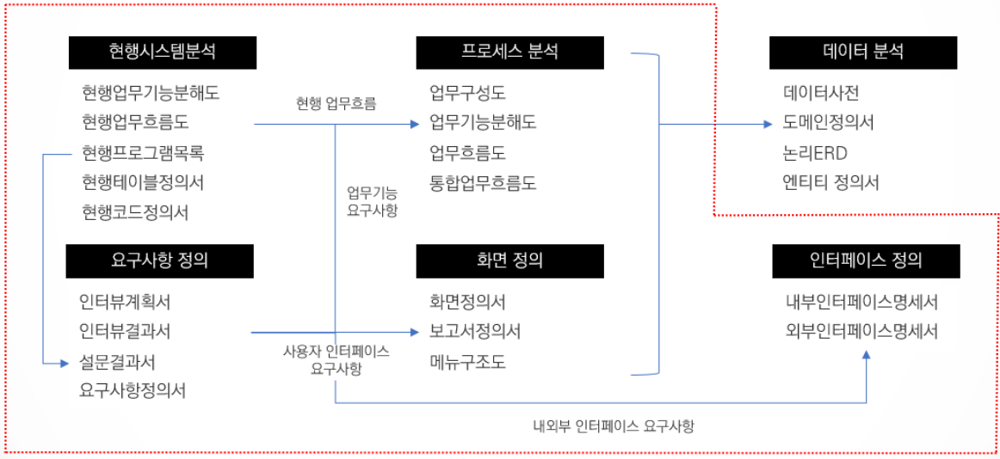

# Module 1. 프로세스 모델링의 중요성

- 사업발주 및 프로젝트 수행 프로세스
- 프로레스 모델링의 중요성
- 프로세스 셀계의 성공 실패 사례

## 사업발주 및 프로젝트 수행 프로세스

사업기획 -> 정보제공요청서(RFI) -> **FP산정** -> 사업계획서 -> 사업품의(투자심의) -> **제안요청서(RFP)** -> 입찰공고 -> **제안서(제안평가)** -> 우선협상대상자 선정 -> 기술협상 -> 작업기술서(SOW) -> 계약서 -> 프로젝트 착수 -> **WBS(초안)** -> **프로젝트 계획서(초안)** -> 프로젝트 착수 보고 -> **요구사항 정의** -> WBS -> 프로젝트계획서 -> 단계말 품질점검/감리 -> **분석/설계** -> 단계말 품질점검/감리 -> 구현(개발/**테스트**) -> 이행 -> 서비스 오픈 -> 품질점검/감리 -> 안정화 -> 운영/유지보수

## 프로세스 모델링의 중요성

### 1) 프로세스 모델링의 중요성

#### 프로세스 모델링 개요

- 프로세스 모델링이란?

조직, 시스템 또는 프로젝트에서 이루어지는 **다양한 활동과 작업 흐름을 시각적으로 표현하거나 체계적으로 분석**하는 과정

프로세스 모델링은 주요 비즈니스 프로세스에 대한 데이터 기반의 시각화 과정 단순히 다어이그램을 그리는 것을 넘어 **워크플로우를 이해하고, 분석하며, 개선하는 포괄적인 활동을 의미**한다.
워크플로우를 이해하고 최적화할 수 잇는 공통 언어를 제공하는 것이 핵심

#### 프로세스 모델링 범위

#### 프로세스 모델링 목적

- **프로세스 시각화/표준화**: 프로세스 가시화를 통한 효율적인 업무 분석/파악.
- **프로세스 최적화**: 비효율적인 작업 흐름, 병목 현상, 중복 작업 식별 및 제거를 통한 최적화
- **의사소통과 협업 증진**: 프로세스 시각화/표준화를 통해 개인/팀/부서 간 의사소통 명확화 및 협업 강화
- **위험 관리**: 프로세스 내 컴플라이언스 준수/환경 변화 등 위험 식별 및 대응방안 마련
- **프로세스 자동화**: 프로세스 시각화/표준화를 통해 자동화를 효과적으로 구현

#### SLDC 단계와 프로세스 모델링

프로세스 모델링은 소프트웨어 개발 생명주기(SLDC)의 모든 단계에서 핵심적인 역할을 수행하며, 각 단계의 성공적인 완수를 지원

- 요구사항 수집 및 분석단계
  - 사용자 및 이해관계자의 요구사항을 시각화
  - 요구사항을 명확하게 이해하고 분석하는 데 도움
  - 누락되거나 모호한 요구사항 식별 가능
  - 개발 방향 설정에 기여
- 설계단계
  - 시스템의 구조, 구성 요소, 업무/데이터 흐름 등을 모델로 표현
  - 시스템의 동작 방식 계획 및 문서화
  - 효율적인 아키텍처 설계 가능
  - 개발 과정에서의 오류 감소
- 개발 단계
  - 설계된 모델을 개발자의 구현 참고자료로 활용
  - 각 컴포넌트의 기능과 상호 작용 방식 이해 지원
  - 코드의 정확성과 일관성 향상
- 테스트 단계
  - 테스트 케이스 및 시나리오 설계에 활용
  - 테스트 범위 정의 및 기능/성능 검증에 기여
  - 요구사항 충족 여부 확인 가능
- 배포 및 유지보수 단계
  - 시스템 운영 중 변경 사항을 모델에 반영
  - 유지보수 작업의 효율성과 정확성 향상
  - 시스템의 안정성 유지에 도움
