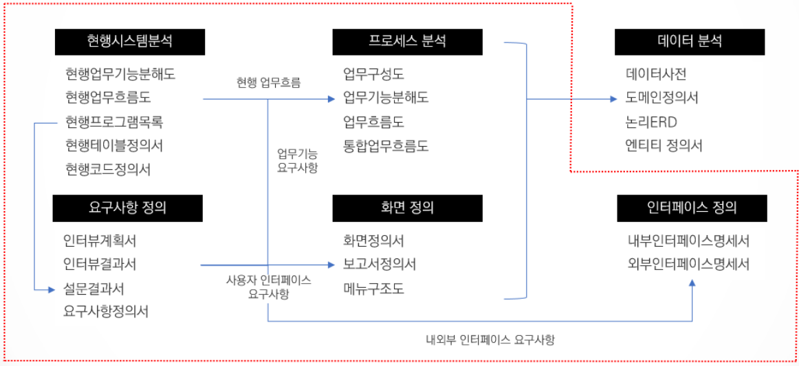
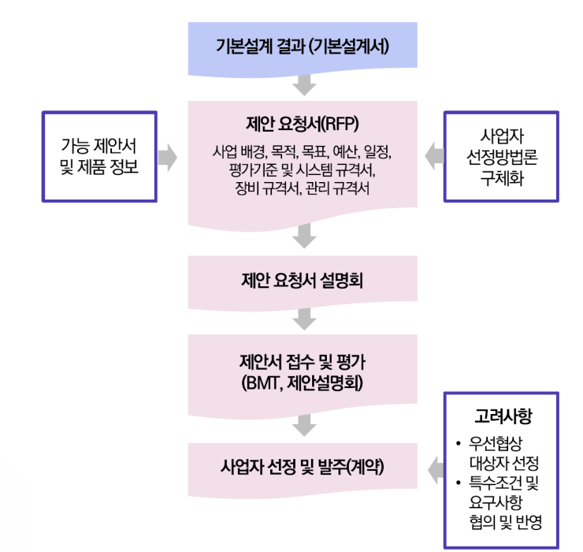
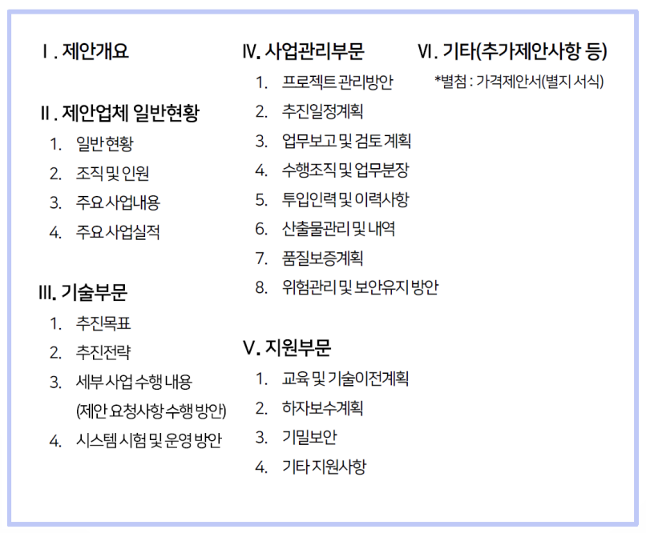
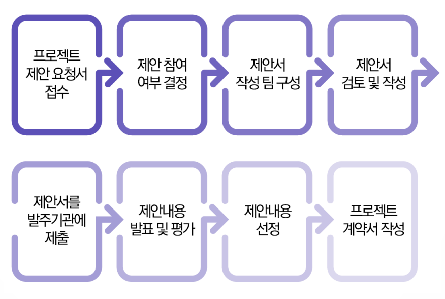
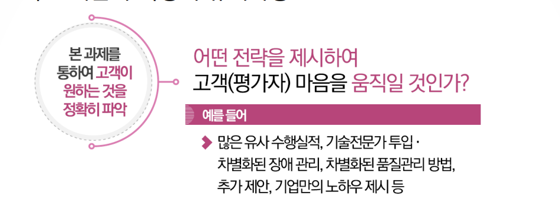
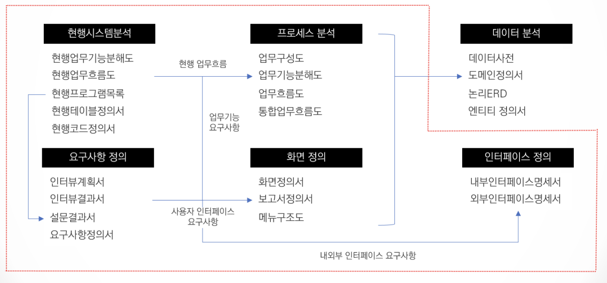

# Module 1. 프로세스 모델링의 중요성

- 사업발주 및 프로젝트 수행 프로세스
- 프로레스 모델링의 중요성
- 프로세스 셀계의 성공 실패 사례

## 사업발주 및 프로젝트 수행 프로세스

사업기획 -> 정보제공요청서(RFI) -> **FP산정** -> 사업계획서 -> 사업품의(투자심의) -> **제안요청서(RFP)** -> 입찰공고 -> **제안서(제안평가)** -> 우선협상대상자 선정 -> 기술협상 -> 작업기술서(SOW) -> 계약서 -> 프로젝트 착수 -> **WBS(초안)** -> **프로젝트 계획서(초안)** -> 프로젝트 착수 보고 -> **요구사항 정의** -> WBS -> 프로젝트계획서 -> 단계말 품질점검/감리 -> **분석/설계** -> 단계말 품질점검/감리 -> 구현(개발/**테스트**) -> 이행 -> 서비스 오픈 -> 품질점검/감리 -> 안정화 -> 운영/유지보수

## 1) 프로세스 모델링의 중요성

### 프로세스 모델링 개요

#### ❓ 프로세스 모델링이란?

조직, 시스템 또는 프로젝트에서 이루어지는 **다양한 활동과 작업 흐름을 시각적으로 표현하거나 체계적으로 분석**하는 과정

프로세스 모델링은 주요 비즈니스 프로세스에 대한 데이터 기반의 시각화 과정 단순히 다어이그램을 그리는 것을 넘어 **워크플로우를 이해하고, 분석하며, 개선하는 포괄적인 활동을 의미**한다.
워크플로우를 이해하고 최적화할 수 잇는 공통 언어를 제공하는 것이 핵심

### 프로세스 모델링 범위



### 🎯 프로세스 모델링 목적

- **프로세스 시각화/표준화**: 프로세스 가시화를 통한 효율적인 업무 분석/파악.
- **프로세스 최적화**: 비효율적인 작업 흐름, 병목 현상, 중복 작업 식별 및 제거를 통한 최적화
- **의사소통과 협업 증진**: 프로세스 시각화/표준화를 통해 개인/팀/부서 간 의사소통 명확화 및 협업 강화
- **위험 관리**: 프로세스 내 컴플라이언스 준수/환경 변화 등 위험 식별 및 대응방안 마련
- **프로세스 자동화**: 프로세스 시각화/표준화를 통해 자동화를 효과적으로 구현

### SLDC 단계와 프로세스 모델링

프로세스 모델링은 소프트웨어 개발 생명주기(SLDC)의 모든 단계에서 핵심적인 역할을 수행하며, 각 단계의 성공적인 완수를 지원

- 요구사항 수집 및 분석단계
  - 사용자 및 이해관계자의 요구사항을 시각화
  - 요구사항을 명확하게 이해하고 분석하는 데 도움
  - 누락되거나 모호한 요구사항 식별 가능
  - 개발 방향 설정에 기여
- 설계단계
  - 시스템의 구조, 구성 요소, 업무/데이터 흐름 등을 모델로 표현
  - 시스템의 동작 방식 계획 및 문서화
  - 효율적인 아키텍처 설계 가능
  - 개발 과정에서의 오류 감소
- 개발 단계
  - 설계된 모델을 개발자의 구현 참고자료로 활용
  - 각 컴포넌트의 기능과 상호 작용 방식 이해 지원
  - 코드의 정확성과 일관성 향상
- 테스트 단계
  - 테스트 케이스 및 시나리오 설계에 활용
  - 테스트 범위 정의 및 기능/성능 검증에 기여
  - 요구사항 충족 여부 확인 가능
- 배포 및 유지보수 단계
  - 시스템 운영 중 변경 사항을 모델에 반영
  - 유지보수 작업의 효율성과 정확성 향상
  - 시스템의 안정성 유지에 도움

# Module 2. 제안요청서 및 제안서의 이해

## 1) 제안 요청서의 이해

### ▶️ 제안 요청서 개요

#### ❓ 제안요청서(RFP: Request For Proposal)란?

- 발주기관이 해결하고자 하는 현안에 대한 **요구사항을 체계적으로 정리**하여 외부(공개입찰을 목적)에 공식적으로 제안을 요청하는 문서

#### 🎯 제안요청서 목적

- 발주사가 요구하는 제품,서비스,시스템 등을 공급업체에 개발,납품 요청
- 단수/복수의 제안사에 대한 평가를 위해 제안사의 능력 점증 방법/평가 지표 제시

#### 제안요청서 접근 방법

- 발주지관 의도 파악 및 프로젝트 특징 분석
- 유사 프로젝트 제안/수행 성공 사례 분석

### ▶️ 제안요청서의 주요 작성 내용

| 목차                   | 설명                                                                                                                                                            |
| ---------------------- | --------------------------------------------------------------------------------------------------------------------------------------------------------------- |
| 표지                   | 사업명,발주처, 발주일자 등을 작성                                                                                                                               |
| 목차                   | 제안 요청서의 내용을 순차적으로 작성                                                                                                                            |
| 사업개요               | 사업명과 내용, 사업외목적, 필요성, 추진절차, 추진일정 등을 포함                                                                                                 |
| **제안요청사항**       | **제안 요구 사항, 과제의 구체적인 범위와 내용을 상세하게 작성**                                                                                                 |
| 입찰 및 계약 관련 사항 | 입찰개요, 사업자 선정 자격, 제안시 구비 서류 및 제출 안내, 제안 평가 및 협상에 관한 사항에 관한 내용 작성                                                       |
| 제출 서류 작성안내     | 제안서 작성 요령, 작성방식, 작성 시 유의 사항, 제안서 목차(예시)등을 포함                                                                                       |
| 붙임 문서              | 제안서의 정량적, 정석적 평가 기준 및 지표, 경영 상태, 연구 인력 자격 기준, 입찰가격 평점 양식 제안사 등 및 제안서 평가에 필요한 준거 자료 및 관련 서식등을 포함 |
| 별첨 서식              | 본 과제 제안을 위해 필요한 서식 및 제안서의 양식 등을 제공                                                                                                      |
| 기타                   | 발주처에서 제공할 필요가 있다고 판단되는 기타 문서 및 서식 등을 제공                                                                                            |

### ▶️ 제안요청서 작성을 위한 기본 설계



**RFP 기본 설계 개념**

- 발주처가 구축하고자 하는 시스템 또는 서비스의 개략적 청사진 제시
- 제안 업체 대상, 제안 방향 및 범위 명확화 목적
- 프로젝트 목표, 주요 기능, 기술 요구사항, 제약 조건 등 포함

**RFP 기본설계의 중요성**

- 제안 방향의 명확과: 제안 업체에 공통된 이해 기반 제공
- 요구사항의 구체적 명시: 추상적 아이디어를 구체화하여 오해방지
- 제안서 비교평가의 용이성 확보: 유사 기준 하 제안서 비교 용이
- 범위 외 제안 사전 방지: 프로젝트 범위/목표 부합 제도 유도, 자원 절약
- 제안 품질 향상 유도: 명확한 가이드라인 통해 심도 있는 제안 촉진

### ▶️ 제안요청서 작성을 위한 기본 설계 범위

**분석(As-Is) 및 문제점(Pain Points)**

- 현 시스템 또는 업무 방식 개요 기술
- 현 시스템의 주요 문제점 및 개선 필요성 명시
- 신규 시스템 도입 배경 및 당위성 제시

  > ex) "현 수기 고객 데이터 관리로 인한 분산 및 활용도 저하, 맞춤형 서비스 제공 한계"

**목표시스템(To-Be) 개요**

- 구축 대상 시스템의 명칭 및 정의 명확화
- 시스템 도입을 통해 달성하고자 하는 구체적 목표 및 기대효과 제시(정량적 목표 권장)
- 프로젝트 범위(구축 대상) 명확히 규정

  > ex) "통합 CRM 시스템 구축 통한 고객 정보 통합, 타겟 마케팅 실행으로 고객 만족도 10% 및 신규 고객 5% 증가 목표. 범위: 고객 정보, 영업 활동, 마케팅 자동화, 서비스 지원 기능"

**주요 기능 정의 (High-Level Functionalities)**

- 시스템의 핵심 기능 목록화 및 각 기능 간략 설명
- 사용자 기능/관리자 기능 구분 제시 가능

  > ex) (온라인 쇼핑몰)
  > 사용자: 회원가입/로그인, 상품검색/상세, 장바구니, 주문/결제, 배송 조회 등
  > 관리자: 상품/회원/주문/재고/프로모션 관리, 통계/분석 등

**시스템 구성도(개념적 아키텍처)**

- 구축 시스템의 전체 구조, 주요 구성 요소, 외부 시스템 연동 관계 등 간략한 다이어그램 제시
- 제안 업체의 기술적 구조 이해 및 구체적 아키텍처 제안 지원

  > ex) 웹/애플리케이션/DB서버 기본 구성 및 기존 ERP, 결제 PG 연동 지점 도식화

**성능 요구사항**

- 시스템의 성능 목표 구체적 제시

  > ex) "주요 페이지 평균 응답 시간 3초 이내", "동시 점속자 최대 500명", "일일 주문 처리량 최소 1,000건"

**보안 요구 사항**

- 데이터 기밀성, 무결성, 가용성 보장 위한 보안 요건 명시
  > ex) "개인정보보호범 등 관련 법규 준수", "주요 데이터 암호화", "역할 기반 접근 통제(RBAC)", "웹 취약점 대응"

**기술적 제약 조건 및 권장 사항**

- 필수 준수 또는 권장 기술 스택, 플랫폼, OS, DB등 명시, 과도한 제약은 지양, 제안 업체의 창의성 고려
  > ex) "OS: Linux 계열 권장", "DB: 특정 버전 이상 오픈소스 또는 상용 DBMS(근거 제시)", "정부 표준 프레임워크 준수(해당 시)"

**데이터 요구사항**

- 관리 대상 주요 데이터 종류, 예상 규모, 보관 주기 등 기술. 데이터 마이그레이션 필요시 대상, 범위, 방식 등 명시
  > ex) "현 엑셀 관리 고객 정보 약 5만건 정제 후 신구 CRM 시스템 마이그레이션"

**인터페이스 요구사항**

- 외부 시스템 연동 시 대상, 방식, 주기, 데이터 항목 등 명시. UI/UX 기본 방향 또는 가이드라인 제시 가능(예: 반응형 웹, 모바일 우선)
  > ex) "기존 ERP와 실시간 재고 정보 연동(RESTful API 우선 고려)"

### ▶️ 제안요청서 작성시 유의사항

- **상세 수준의 적정성 유지**: 추상성과 구체설 간 균형(What 중심, How는 제안유도)
- **제안의 유연성 확보**:특정 기술.솔루션 과도한 제한 지양, 혁신적 제안 수용. (단, 핵심 제안은 명시)
- 시각자료 적극 활용: 다이아그램, 플로우차트 등 이해도 증진.
- RFP 전체 내용과 **일과성 확보**.
- 요구사항의 현실성 및 기술적 실현 가능성 사전 검토.
- 사용 용어의 통일성 유지 및 필요시 **용어 정의 제공**.

## 3) 제안서의 이해

### ▶️ 제안서의 개요

#### ❓ 제안서(Proposal)란?

- 제안사(수행사)가 프로젝트 수주를 목적으로 제안요청서에 대응하여 작성하는 문서

제안서 작성

1. 프로젝트 수주를 위하여 기업이 제안하는 문서
2. 발주기관의 **제안 요청서의 요청내용을 중심**으로 분석
3. 기업의 **과제수행역량**(소요인력, 기술력, 수행경험 등)을 파악
4. **소요비용, 과제수익, 과제기간**을 종합적으로 분석
5. 과제의 **참여를 결정**하면 제안 팀을 구성하여 **제안서 작성**

### ▶️ 제안서 주요 내용



### ▶️ 프로젝트 제안 절차



1. 프로젝트 제안 요청서 접수
2. 제안 참여 여부 결정
3. 제안서 작성 팀 구성
4. 제안서 검토 및 작성
5. 제안서를 발주기관에 제출
6. 제안 내용 발표 및 평가
7. 제안내용 선정
8. 프로젝트 계약서 작성

### ▶️ 프로젝트 제안서 작성시 유의사항


본 과제를 통하여 **고객이 원하는 것을 정확히 파악**
-> 어떤 전략을 제시하여 고객(평가자) 마음을 움직일 것인가?

> 많은 유사 수행실적, 기술 전문가 투입, 차별화 된 장애 관리, 차별화 된 품질관리 방법, 추가 제안, 기업만의 노하우 제시 등

- 제안 요청서의 핵심 의도파악 및 충실한 반영
- 프로젝트 수행을 위한 전문성, 경험과 노하우 강조
- 프로젝트의 특성에 따른 위험요소 식별 및 대응방안 포함
- 추가 제안사항 고려(비용 고려)

#### 핵심 메시지 명확화

- 제안서 전체를 관통하는 단 하나의 핵심 메시지를 명확히 제시; 무엇을 해결하고, 어떤 가치를 제공하는가?

* [BAD] 본 시스템은 다양한 기능을 통해 업무 효율성을 증대시킵니다.
* [GOOD] "업무 자동화 시스템 도입으로 단순 반복 업무 50% 감축, 핵심 업무 집중도 30% 향상"

#### 고객문제 정의 및 공감

- 고객이 겪는 어려움과 문제점을 명확히 하고 깊은 이해와 공감을 표현

* [BAD] 귀사의 현재 시스템은 개선이 필요합니다.
* [GOOD] 현재 A 시스템의 잦은 오류와 느린 처리 속도로 인해 월평균 20시간의 업무 손실이 발생하고 있으며, 담당자들의 피로도가 높은 것으로 파악됩니다.

#### 해결책 구체적 제시

- 제안하는 솔루션이 고객의 문제를 어떻게 해결할 수 있는지 구체적인 방법과 기대 효과를 제시, 두루뭉실한 설명 지양

* [BAD] 저희 솔루션은 귀사의 문제를 해결할 수 있습니다.
* [GOOD] "제안 드리는 '스마트 B 솔루션'은 AI기반 자동 분류기능을 통해 오류 발생 가능성을 99% 차단하고, 클라우드 기반 분산 처리로 기존 대비 3배 빠른 속도를 제공하여 월평균 18시간의 업무 시간 절감을 기대할 수 있습니다."

#### 차별화 된 강점 부각

- 경쟁사 대비 우리가 가진 독보적인 강점, 기술력, 경혐 등을 명확히 제시

* [BAD] 저희는 뛰어난 기술력을 보유하고 있습니다.
* [GOOD] "당사는 국내 유일의 '데이터 암호화 특허 기술'을 보유하고 있으며, 유사 업종 100개사 이상의 구축 경험을 통해 안정적인 시스템 운영 노하우를 축척했습니다."

#### 실행 계획 및 일정 명시

- 제안 내용을 실제로 어떻게 구현하고 완료할 것인지 단계별 실행 계획과 구체적인 일정을 제시하여 신뢰감 형성

* [BAD] 8주내 구축 완료하겠습니다.
* [GOOD]
  1단계: 요구사항 분석 및 설계(계약 후 2주)
  2단계: 시스템 개발 및 테스트(4주)
  3단계: 시스템 오픈 및 안정화(2주)
  총 예상 소요 기간: 8주

#### 간경하고 명확한 문장 사용

- 전문 용어 사용을 최소화 하고, 쉽고 명확한 단어로 간결하게 작성. 핵심 내용 위주로 전달

* [BAD] 단사의 프로프라이어터리 알고리즘을 활용한 온톨로지 기반의 시멘틱 분석 프레임워크는,,,
* [GOOD] "자체 개발한 분석 기술을 통해 문서의 핵심 내용을 정확하게 파악하고, 의미 단위로 정보를 연결하여 사용자에게 필요한 정보를 빠르게 찾아줍니다."

#### 고객 맞춤형 내용 구성

- 일반적인 내용 나열이 아닌, 해당 고객의 특성과 요구사항에 맞춰 제안 내용을 구성

* [BAD] (모든 고객에게 동일하게 발송하는 제안서 내용)
* [GOOD] "귀사의 '2025년 디지털 전환 전략'목표 달성을 위해, 특히 '제조공정효율화'부분에 당사의 E-솔루션이 최적의 파트너가 될 수 있습니다. E-솔루션의 실시간 데이터 분석 기능은 귀사 생산 라인의 병목 지점 파악 및 개선에 직접적으로 기여할 것입니다."

#### 명확한 Call to Action(행동 촉구)

- 제안서 마지막에 고객이 다음 단계로 무엇을 하길 바라는지 명확하게 제시. (예: 미팅요청, 계약문의 등)

* [BAD] 긍정적인 검토 부탁드립니다.
* [GOOD] "본 제안 내용관 관련하여 궁금하신 점이나 추가 논의가 필요하시면 언제든 편하게 연락 주십시오. 다음 주 중 편하신 시간에 방문하여 상세히 설명드릴 수 있도록 미팅 일정을 제안 드립니다. (담당자: 000팀장, 010-XXXX-XXXX)"

# Module 3. 프로세스 모델링 개요

- 프로젝트 계획서
- 프로세스 모델링 개요

## 1) 프로젝트 계획서

### ▶️ 프로세스 계획서 사전 준비

#### WBS(Work Breakdown Structure) 개요

#### ❓ WBS란?

- 프로젝트 범위와 일정을 세부적으로 나눈 작업 분할 구조도 프로젝트의 목표 달성을 위해 필요한 활동과 업무를 계층적으로 구조화 하고 **관리가능한 수준으로 세분화**하여 분할한 후 수행일정과 담당자, 산출물을 할당

#### 🎯WBS 작성 목적

**프로젝트 범위 정의 및 명확화**

- 프로젝트의 모든 작업을 체계적으로 분해하여 프로젝트 범위(Scope)를 명확히 정의. 누락되거나 중복되 작업이 없도록 보장하여 프로젝트 목표 명확화

**관리 용이성 확보**

- 프로젝트를 작은 단위의 작업으로 세분화하여 관리 용이. 작업단위로 세분화되면 일정, 자원, 비용을 보다 정화히 계산하고 추적 가능

**책임 할당 및 의사소통**

- 각 작업 단위를 담당자에게 할당하여 책임과 권한을 명확히 규정. WBS를 통해 프로젝트 팀 내의 역할과 책임 명확화 및 의사소통 원활화

**성과 측정 및 추적**

- WBS를 기준으로 작업의 진척 상황을 평가하고, 프로젝트 진행 상태를 추적 가능. 각 작업 단위의 성과를 측정하여 프로젝트가 계획대로 진행되고 있는지 확인

**리스크 식별 및 관리**

- 프로젝트 진행 과정에서 발생할 수 있는 위험 요소(리스크)를 조기에 식별. 각 작업 단위별로 잠재적인 문제를 분석하고 대처 방안을 마련 가능

**프로젝트 통제 및 변경 관리**

- 프로젝트 진행 중 발생하는 변경 사항을 통제할 수 있는 기준을 제공. 작업 단위별로 변경 사항이 미치는 영향을 분석하여 효율적인 변경 관리 가능

### ▶️ 프로세스 계획서 개요

#### ❓ 프로젝트 계획서란?

- 프로젝트 수행에 필요한 목표, 일정, 예산, 자원, 위험요소 등을 문서화 한 공식 문서
- 프로젝트의 성공적인 수행을 위해 명확한 로드맵을 제공
- 팀원 및 이해관계자(Stakeholder)간의 원활한 협업 지원

- 프로젝트 관리를 위한 **총괄 계획서 작성 프로세스**
- 프로젝트 **작업의 기준을 정의하는 문서**
- 프로젝트를 **수행, 감시, 통제, 종료하는 방법을 정의**
- 프로젝트 **응용분야와 복잡성에 따라 내용이 달라짐**

#### 프로젝트 계획서 작성 시 유의사항

1. 원활한 의사소통을 위해 **이해하기 쉽고 읽기 쉬울것**
2. 전체 팀원과 이해관계자 **모두가 잘 알고 있을 것**
3. 프로젝트 **규모, 복잡도, 중요도에 맞춰 적절**할 것
4. 개인보다는 **팀에 의해서 준비**될 것

### ▶️ 프로세스 계획서 작성

### ▶️ 버전 정보 및 승인인력

### ▶️ 프로젝트 개요

#### 추진 Roadmap

#### 대상 업무

#### 세부 수행 범위

#### 주요 이슈 사항

#### 시스템 구성도

#### 추진 일정

#### 인력투입계획

#### 의사소통계획

#### 교육훈련계획

## 2) 프로세스 모델링 개요

### ▶️ 프로세스 모델링 관련 Over View



### ▶️ 현행 시스템 분석

#### 현행 시스템 분석 이란?

- 현행 시스템 및 업무를 비즈니스와 게이터 관점에서 분석하여, 시스템 및 업무를 비즈니스와 데이터 차원에서 이해

#### 현행 시스템 분석 단계에서는...

- 업무 영역의 핵심 프로세스를 파악
- 향후 데이터 분석 및 데이터 전환의 자료로도 활용

### ▶️ 현행 시스템 분석 절차

> 분석전략수립 > 자료 요청 및 수집 > 분석 > 결과롹인 > 개선사할 정의

| 스텝                         | 태스크                                                                                     |
| ---------------------------- | ------------------------------------------------------------------------------------------ |
| 현행시스템 분석 전략 수립    | - 고객사의 시스템 상황별 분석 전략 수립                                                    |
| 현행시스템 자료 요청 및 수집 | - 요구사항 수집/정의/검토                                                                  |
| 현행시스템 분석              | - 현행 프로세스 분석/ 현행 데이터 분석                                                     |
| 분석결과 확인                | - 현행시스템의 프로세스와 데이터 분석 결과 고객확인 워크샵 수행                            |
| 개선사항 정의                | - 현행시스템 분석 결과를 토대로 개선 사항 정의 <br> -향후 요구사항 및 프로세스 정의에 활용 |

### ▶️ 현행 시스템 분석

#### 현행 시스템 분석 절차

1. **구성, 기능, 인터페이스 현황**을 파악하는 단계

- 시스템 구성 현황 파악
- 시스템 기능 파악
- 시스템 인터페이스 현황 파악

2. **아키텍처 및 소프트웨어 구성 현황**을 파악하는 단계

- 아키텍처 파악
- 소프트웨어 구성 파악

3. **하드웨어 및 네트워크 구성 현황**을 파악하는 단계

- 시스템 하드웨어 현황 파악
- 네트워크 구성 파악

#### 현행 시스템 파악

> 사용자 요구사항을 확인 하기 위한 준비단계

- 주요 시스템의 현황을 파악하는 것은 매우 중요한 활동
- **현황 시스템 파악 주요활동**
  - 현행 시스템이 어떤 하위 시스템으로 구성되어 있는지 파악
  - 제공하는 기능이 무엇인지 파악
  - 다른 시스템들과 어떤 정보를 주고받는지 파악
  - 어떤 기술요소를 사용하고 있는지 파악
  - 사용하고 있는 소프트웨어 및 하드웨어는 무엇인지 파악
  - 네트워크는 어떻게 구성되어 있는지 등을 파악

### ▶️ 현행 시스템 분석 자료 수집

- 정보 시스템 구성/기능 및 인터페이스
- 현행 시스템 아키텍처 및 소프트웨어
- 하드웨어 및 네트워크; 해당 부분에 대하여 **수집할 자료의 목록**을 정하는 것이 중요함!
- 자료 수집을 위해 현행 시스템 담당자가 제시한 자료와 면담 기록에 필요한 자료의 존재 여부를 파악
  - 관련 자료가 문서로 존재하지 않는 경우
    - 현행 시스템 담당자와 면담이 가능하다면 실사 등을 통해서 작성
  - 관련자료가 문서로 존재하는 경우
    - 현행 상황이 제대로 반영 되었는지 살펴보고, 실사를 통하여 현행화 필요

#### 현행 시스템 분석 자료 수집 대상 예시

| 구분                                  | 취득할 자료                                            |
| ------------------------------------- | ------------------------------------------------------ |
| 정보시스템 구성/기능 및 인터페이스    | - 정보시스템 구성 및 기능 구성도<br>-인터페이스 현황도 |
| 현행 시스템 및 아키텍처 및 소프트웨어 | - 현행 시스템 아키텍처 구성도<br>-소프트웨어 구성도    |
| 하드웨어 및 네트워크                  | -하드웨어구성도<br>-네트워크구성도                     |

- 해당 자료가 없을 경우

  - 운영자 메뉴얼, 사용자 메뉴얼, 현행 시스템 구축 제안서
  - 분석서
  - 설계서에서 관련 자료 발췌

- 자료를 취득할 경우
  - 자료의 출처, 수령한 시점, 현행 시스템과 동기화 여부, 담당자의 의견 등을 기록

### ▶️ 현행 시스템 중점 분석 사항

| 구분                                 | 수집 자료목록               | 중점사항                                                                                                   |
| ------------------------------------ | --------------------------- | ---------------------------------------------------------------------------------------------------------- |
| 정보 시스템 구성/ 기능 및 인터페이스 | 정보시스템 구성/기능구성도  | 정보시스템의 구분, 정보시스템 명, 주요기능, 정보 시스템의 기능 구성                                        |
| -                                    | 인터페이스 현황             | 송신 시스템, 수신 시스템, 연계방식, 주기, 연동 데이터 형식, 주요 연동 데이터                               |
| 현행 시스템 아키텍처 및 소프트웨어   | 현행 시스템 아키텍처 구성도 | 운용체제의 종류, 적용 프레임워크, 계층별 적용 기술, 데이터 연동 방식, 데이터 저장소, 외부 시스템 연계 방식 |
| -                                    | 소프트웨어 구성도           | 단위 시스템 별 필요 소프트웨어의 제품명, 용도, 라이선스 적용 방식, 라이선스 수                             |
| 하드웨어 및 네트워크                 | 하드웨어 구성도             | 단위 시스템 별 서버 제품명, 용도, CPU, 메모리, 하드디트스 용량, 수량, 이중화 적용 여부                     |
| -                                    | 네트워크 구성도             | 네트워크 장비의 용도, 제품명, 수량, 주요 사항, 위치, 연동 프로토콜                                         |

### ▶️ 현행 시스템 분석

#### 현행 시스템 구성현황 분석

구성 현황 파악

> 조직의 주요 업무를 처리하는 기간 업무과 이를 지원하는 지원 업무로 구분하여 기술

- **현황 시스템구성 현황 작성 시 고려사항**
  - 업무에 속하는 단위 업무 정보 시스템들의 명칭, 주요 기능들을 명시 함으로써 조직 내 존재하는 모든 정보 시스템의 현황을 파악 함
  - 단순히 정보 시스템을 분석하는 것으로는 요구사향을 확인하기 어려우며, 기업 또는 조직의 현행 업무에 대한 분석이 병행 되어야 함
    -> 현행 업무 분석서도 병행 작성할 것!

#### 현행시스템 기능 분석

인터페이스 현황 파악

> 단위 업무 시스템이 다른 단위 업무 시스템과 주고받을 것을 명시

- 데이터의 종류, 데이터 형식, 프로토콕, 연계유형, 주기 등을 파악
- **인터페이스 현황 작성 시 고려사항**
  - 어떤 형식(Format)으로 데이터를 주고받는지 확인
    -> XML, 고정 포멧, 가변 포멧 등
  - 어떤 통신규약을 사용하고 있는지 확인
    -> TCP/IP, X.25 등
  - 연계유형은 무엇인지 확인
    -> EAI, FEP 등

```
[개요]

[현행 업무 분석]    - 현행 업무 구성
                - 현행 업무 절차도

[현행 시스템 모델]  - 현행 시스템 특징
                - 현행 시스템 구성도
                - 시스템 운영 현황 -> 플랫폼, 시스템 소프트웨어, 프로그램 목록, 시스템 백업 현황

[현행 데이터 구성]  - 현행 데이터 구성의 특징
                - 현행 데이터 구성 -> 데이터베이스 구성, 주제 영역, 테이블 목록, 현행 엔티티 관계도

[현행 인터페이스 정의] - 외부 인터페이스 목록
                  - 내부 인터페이스 목록
```

#### 현행 시스템 **아키텍처 구성** 분석

아키텍처구성도

> 기간 업무를 수행하기 위하여 계층별로 사용하고 있는 기술 요소들을 최상위 수준에서 그림으로 표현

- **현행 시스템 아키텍처 구성도 작성 시 고려사항**
  - 단위 업무 시스템별로 아키텍처가 다른 경우에는 가장 핵심이 되는 기간 업무 처리 시스템을 기준으로 할 것
    회사의 목적이 되는 중요 업무를 처리하는 시스템 -> 기간(레거시) 시스템

#### 현행 시스템 **소프트웨어 구성** 분석

소프트웨어 구성도

> 단위 업무 시스템의 업무 처리를 위해 설치되어 있는 소프트웨어들을 명시

- 제품명, 용도, 라이선스 적용 방식, 라이선스 수를 파악
- **현행 시스템 아키텍처 구성도 작성 시 고려사항**
